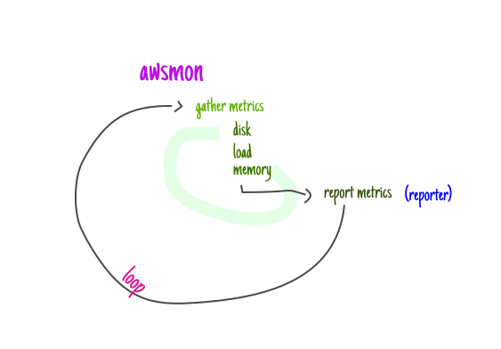

<h1 align="center">awsmon 📡</h1>

<h5 align="center">Sends custom memory, disk and load statistics back to AWS CloudWatch</h5>

## Overview

EC2 instances don't have memory and disk statistics by default. 

This project aims at providing a single static binary that gives you such capabilities.

*ps.: this started as a fork of [go-aws-mon](https://github.com/a3linux/go-aws-mon/), now also providing with static configuration, non-aws mode and continuous execution.*

## Table of Contents

- [How it works](#how-it-works)
- [Installation](#installation)
- [Usage](#usage)
- [Configuration](#configuration)
- [Necessary permissions](#necessary-permissions)
- [Running it while instance is alive](#running-it-while-instance-is-alive)
- [AWS](#aws)
- [LICENSE](#license)


## How it works

`awsmon` is meant to work as a daemon that continuously pulls metrics from a live Linux system and forward these metrics to a reporter.

<div align="center">
  
</div>

A reporter that implements the `Reporter` interface then takes these collected metrics and send them - in the case we're interested in (AWS), there's the `CloudWatchReporter`, which reports to `CloudWatch`.


## Installation

You can either use `go` or fetch the binary directly from [GitHub releases page](https://github.com/cirocosta/awsmon/releases):

```sh
go get -u github.com/cirocosta/awsmon
```

or

```sh
# Change the VERSION variable to the latest 
# you find in `releases` section.
readonly VERSION="2.9.0"
readonly URL="https://github.com/cirocosta/awsmon/releases/download/v${VERSION}/awsmon_${VERSION}_linux_amd64.tar.gz"
readonly BINARY_DESTINATION="/usr/local/bin/awsmon"

# Create a temporary location for the compressed
# tarball.
mkdir -p /tmp/awsmon

# Download the tarball
curl -o /tmp/awsmon/awsmon.tar.gz -L $URL

# Extract its contents
tar xzfv /tmp/awsmon/awsmon.tar.gz -C /tmp/awsmon

# Move the executable binary to the final destination.
sudo mv /tmp/awsmon/awsmon $BINARY_DESTINATION
```

## Usage

This software is meant to be run inside of AWS EC2 instances that need to have memory, load and disk metrics collected (not done by default by AWS' standard monitoring).

For quickly testing whether `awsmon` collects the metrics you expect, it can also be run from a regular Linux and have its metrics printed out to `stdout`.


```sh
Usage: awsmon [...opts]

Options:
  --config CONFIG        path to awsmon configuration file [default: /etc/awsmon/config.json]
  --debug                toggles debugging mode
  --disk DISK            retrieve disk samples from disk locations [default: [/]]
  --interval INTERVAL    interval between samples [default: 30s]
  --load-15m             retrieve load 15m avgs
  --load-1m              retrieve load 1m avgs [default: true]
  --load-5m              retrieve load 5m avgs
  --memory               retrieve memory samples [default: true]
  --relativize-load      makes loadavg relative to cpu count [default: true]
  --aws                  whether or not to enable AWS support
  --aws-access-key AWS-ACCESS-KEY
                         aws access-key with cw putMetric caps
  --aws-aggregated-only
                         region for sending cloudwatch metrics to
  --aws-asg AWS-ASG      autoscaling group that the instance is in
  --aws-instance-id AWS-INSTANCE-ID
                         id of the instance (required if wanting AWS support)
  --aws-instance-type AWS-INSTANCE-TYPE
                         type of the instance (required if wanting AWS support)
  --aws-namespace AWS-NAMESPACE
                         cloudwatch metric namespace [default: System/Linux]
  --aws-region AWS-REGION
                         region for sending cloudwatch metrics to
  --aws-secret-key AWS-SECRET-KEY
                         aws secret-key with cw putMetric caps
  --help, -h             display this help and exit
```


## Configuration

The necessary parameters for configuring `awsmon` can either be provided via CLI arguments (see the [Usage section](#usage)), or a configuration file in JSON format (that you can indicate where it lives via `--config`).

Such file takes the very same parameters as the CLI.

A fully complete configuration of it would look like this (with default values filled):

```json
{
  "debug": false,
  "disk": [
    "/"
  ],
  "interval": 30000000000,
  "load-15m": false,
  "load-1m": true,
  "load-5m": false,
  "memory": true,
  "relativize-load": true,
  "aws": false,
  "aws-access-key": "",
  "aws-aggregated-only": false,
  "aws-autoscaling-group": "",
  "aws-instance-id": "",
  "aws-instance-type": "",
  "aws-namespace": "System/Linux",
  "aws-region": "",
  "aws-secret-key": ""
}
```

Note that not all the instance configurations need to be specified. That's only needed in case you can't (or want to avoid) making calls to the [EC2 metadata service](https://docs.aws.amazon.com/AWSEC2/latest/UserGuide/ec2-instance-metadata.html).

You're also not required to provide a static access key and secret key - if you're instance makes use of instance profiles, `awsmon` is able to retrieve temporary credentials via EC2's metadata systems.


## Necessary permissions

The only permission needed by `awsmon` is `cloudwatch:putMetricData`. 

If you're unsure of how to create an instance that has such capability, check out the `./example` directory. 

It contains [terraform](https://terraform.io) files that create an instance with the right permissions.


## Running it while instance is alive

In order to keep the binary running through the whole life of the instance, `awsmon` can be configured as a `systemd` service with something like the following:

```
[Unit]
Description=awsmon

[Service]
User=root
ExecStart=/usr/local/bin/awsmon
Restart=always
RestartSec=3

[Install]
WantedBy=default.target
```

## Debugging

If you're unsure about whether the metrics are really being succesfully sent to CloudWatch, enable debug (append `--debug` to the configuration). 

This will print out the AWS client logs so that you can be sure whether you have an authorization problem.


## LICENSE

See `./LICENSE` (inherits from the fork).

